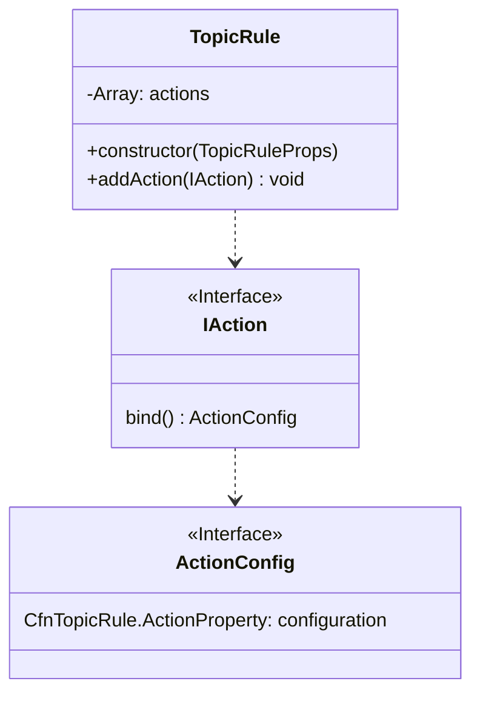
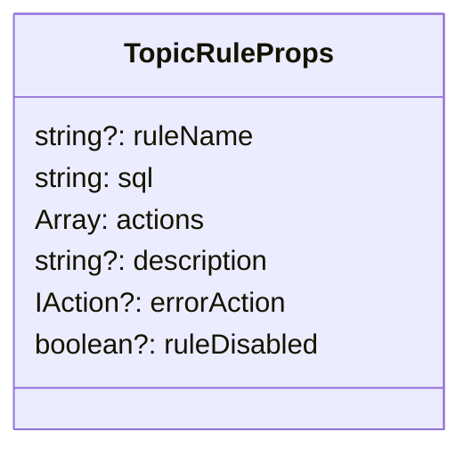
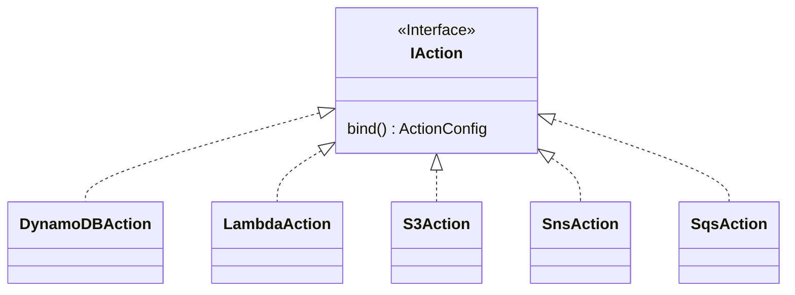
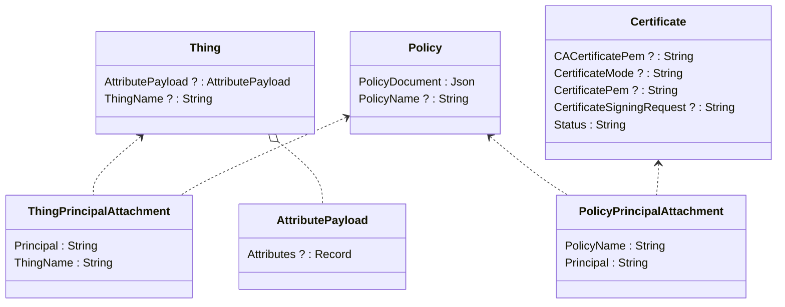
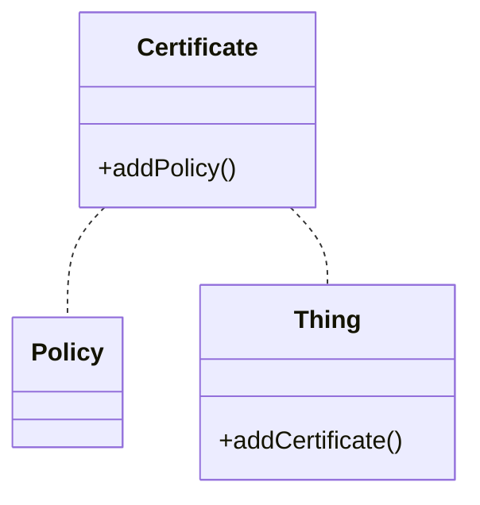
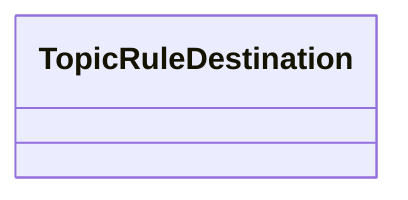
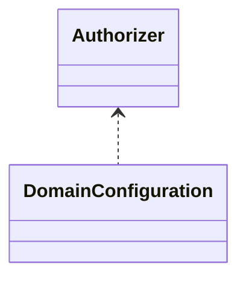
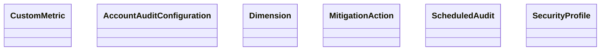
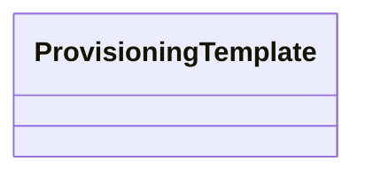
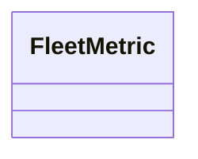

考え中の公開ノート。

# 実装済み

## TopicRule

現状: あとは actions を実装していけばよい。

方針

- Actions のあたりは EventBridge の Target と CFn の構造が似てるのでリスペクトするのが良さそう。

### TopicRule



### TopicRuleProps



### TopicRuleActions

package として分離している。aws-events-targets と同じイメージ。



作るべき Action クラスは以下の通り。多い。。。

- [On Going] CloudwatchAlarmAction
- [On Going] CloudwatchLogsAction
- [On Going] CloudwatchMetricAction
- [On Going] DynamoDBAction
- [On Going] DynamoDBv2Action
- [On Going] LambdaAction
- [On Going] RepublishAction
- [On Going] S3Action
- [On Going] SnsAction
- [On Going] SqsAction
- [To Be Developed] ElasticsearchAction
- [To Be Developed] FirehoseAction
- [To Be Developed] HttpAction
- [To Be Developed] IotAnalyticsAction
- [To Be Developed] IotEventsAction
- [To Be Developed] IotSiteWiseAction
- [To Be Developed] KafkaAction
- [To Be Developed] KinesisAction
- [To Be Developed] StepFunctionsAction
- [To Be Developed] TimestreamAction

# 考え中

## Thing 関連

プロダクションで使われなそうなので放っておいたが、cdk の issues を見ると思ったよりニーズありそうなので、実装を考える。

### CFn



### 雑案



### 課題

Certificate の使い方なぁ。。プロダクトユースを諦めて個人利用向けにするなら、Custom Resource にして[CreateKeysAndCertificate](https://docs.aws.amazon.com/iot/latest/apireference/API_CreateKeysAndCertificate.html)を叩く方が良いんだよなぁ。なやむ。

# 一旦考えない

#### Destination 関連



#### Authorizer とか Domain 設定とか



#### Device Defender 関連



#### Device provisioning 関連



#### Fleet indexing service 関連



# コミット済み

# ナレッジ、苦しんだこと

もしかしたら人のためになるかもしれないことも書いてみる。

## package をビルドするとき

コミットしたい package があったとして、その package が依存しているすべての package を依存グラフに基づいてビルドしなければいけない。

以下 scripts でトポロジカルソートした順序でビルドしていってくれる。
でも全部再ビルドするから効率は良くない。。。

```
scripts/buildup
```

## ゴミビルドが残っているとき

リポジトリを久しぶりに pull したり、別の package を開発した直後だったりすると、存在してはいけない`*.js`や`*.d.ts`が残っている場合がある。これらがビルドを邪魔する時がある。

以下 script でいらん成果物を削除してくれる。

```
scripts/clean-stale-files.sh
```

## lint で怒られる。

頑張るしかない。「doc 書いてよ」系は自分で作文するより公式 Document の文をオマージュする感じのほうが安全と思う。

この作業が一番ボリュームあるかもしれない。

## CodeBuild が通らない

いやこれが一番時間食った。

https://github.com/aws/aws-cdk/pull/16681#issuecomment-929944810

flaky に`Out of memory`がでる。辛い。

`Out of memory`について、未だ根本的な解決してない。

加えて、flaky な箇所の先で、`individual-packages`上で行われるテストがコケてて辛かった。再現方法がわからん now。`scripts/transform.sh`で`individual-packages`の中身を作ってから build すれば良いんだと思われるがなかなかビルドが通らん now。

更新したい。
