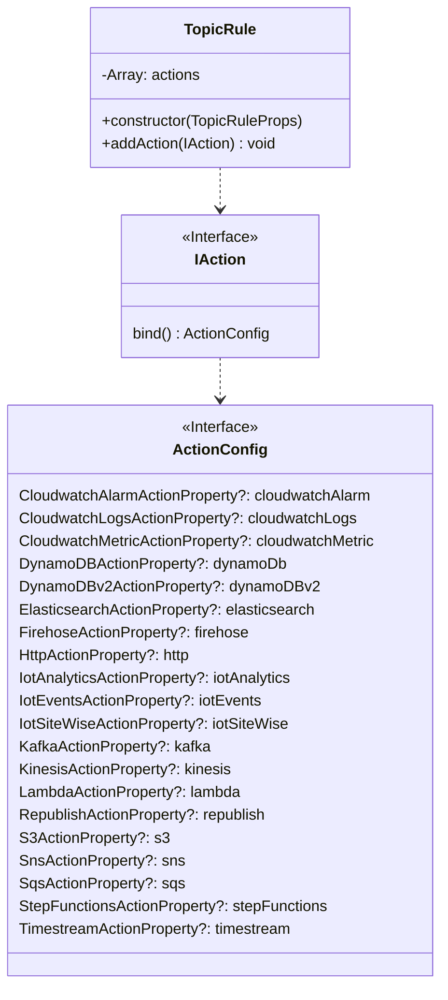
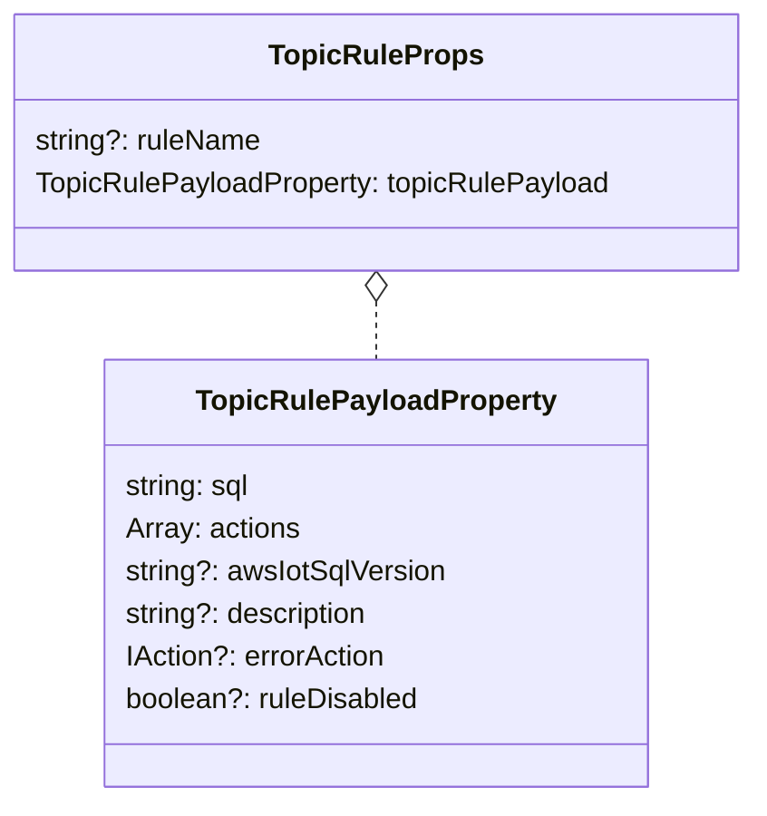
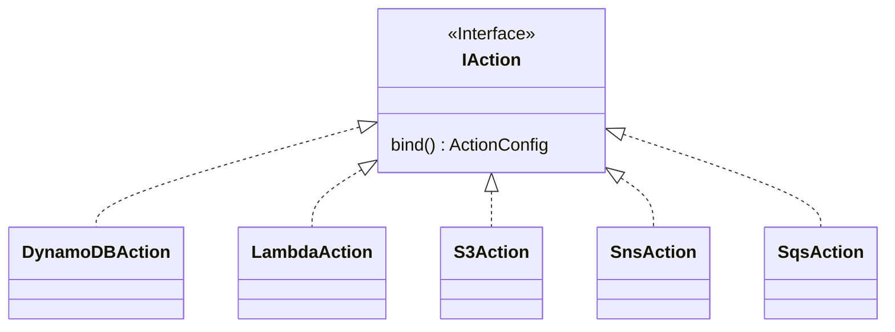
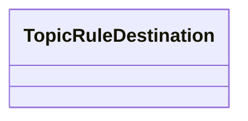
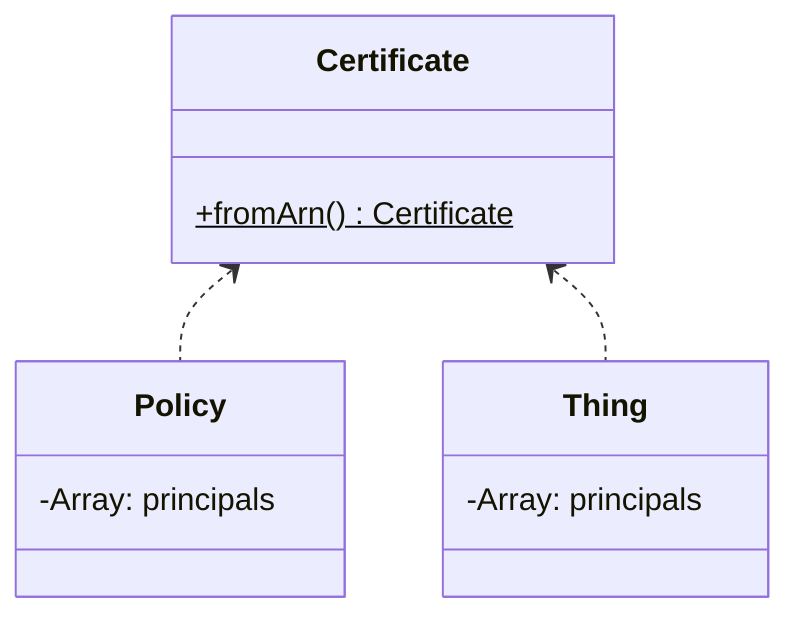
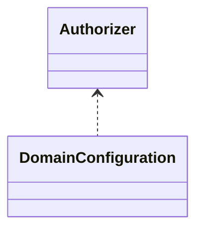
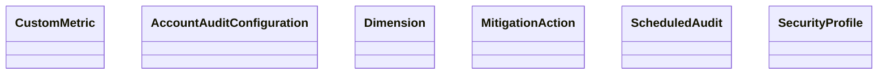
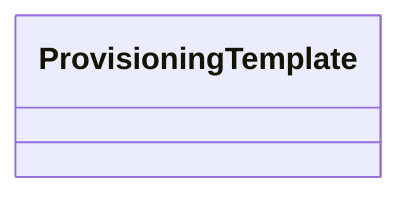
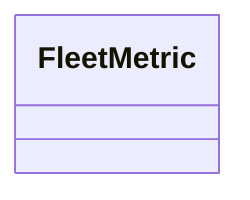

考え中の公開ノート。

# 考え中

## TopicRule

方針

- Actions のあたりは EventBridge の Target と CFn の構造が似てるのでリスペクトするのが良さそう。

### TopicRule

### TopicRuleProps

### TopicRuleActions

package として分離している。aws-events-targets と同じイメージ。

作るべきActionクラスは以下の通り。多い。。。

- [On Going] CloudwatchAlarmAction
- [On Going] CloudwatchLogsAction
- [On Going] CloudwatchMetricAction
- [On Going] DynamoDBAction
- [On Going] DynamoDBv2Action
- [On Going] LambdaAction
- [On Going] RepublishAction
- [On Going] S3Action
- [On Going] SnsAction
- [On Going] SqsAction
- [To Be Developed] ElasticsearchAction
- [To Be Developed] FirehoseAction
- [To Be Developed] HttpAction
- [To Be Developed] IotAnalyticsAction
- [To Be Developed] IotEventsAction
- [To Be Developed] IotSiteWiseAction
- [To Be Developed] KafkaAction
- [To Be Developed] KinesisAction
- [To Be Developed] StepFunctionsAction
- [To Be Developed] TimestreamAction

# 一旦考えない

#### Destination 関連

#### Thing 関連

#### Authorizer とか Domain 設定とか

#### Device Defender 関連

#### Device provisioning 関連

#### Fleet indexing service 関連

