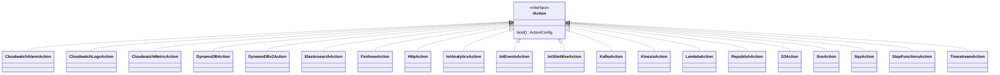

# 考え中

## TopicRule

方針

- Actions のあたりは EventBridge の Target と CFn の構造が似てるのでリスペクトするのが良さそう。

### TopicRule

### TopicRuleProps

### TopicRuleActions

package として分離している。aws-events-targets と同じイメージ。

# 一旦考えない

#### Destination 関連

#### Thing 関連

#### Authorizer とか Domain 設定とか

#### Device Defender 関連

#### Device provisioning 関連

#### Fleet indexing service 関連

