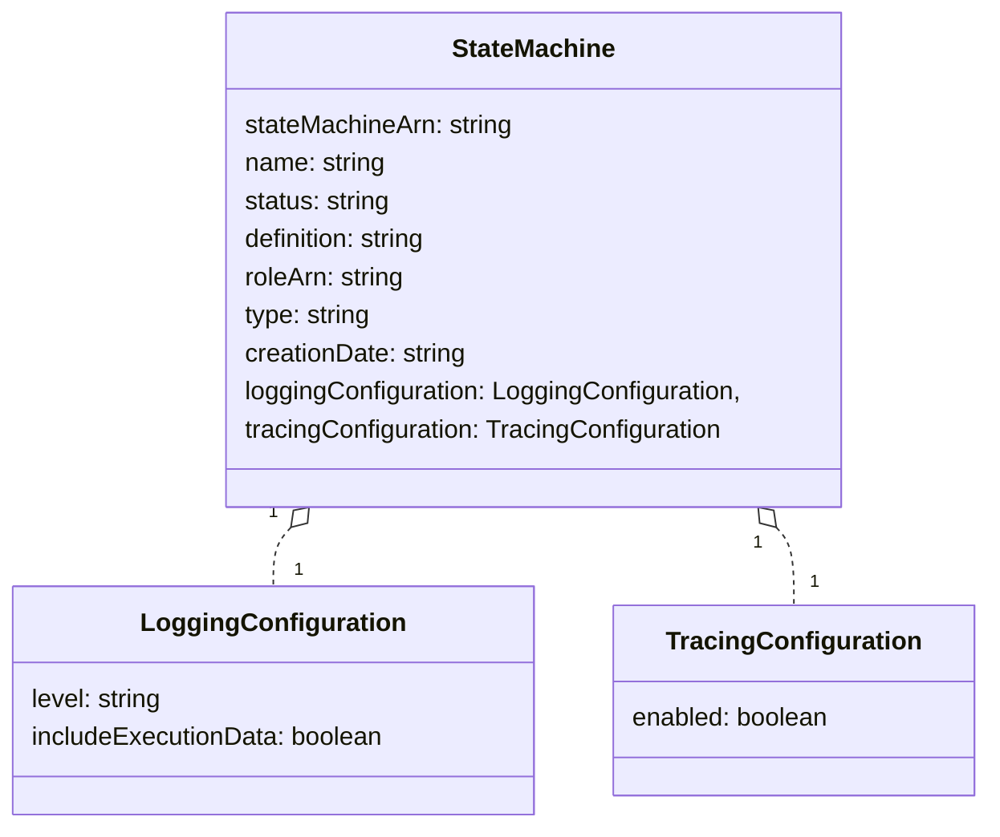
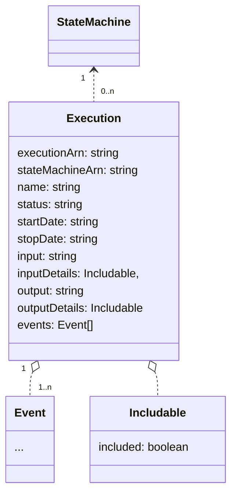
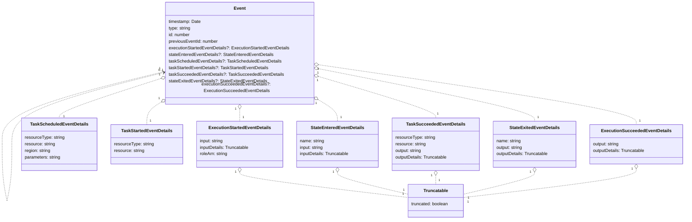

step functions と仲良くなりたかったのでメモ 📝

## StateMachine

definition に大事な情報がいっぱい詰まっている。JSON 文字列としてな。



#### definition

```json
{
  "StartAt": "MyLambdaTask",
  "States": {
    "MyLambdaTask": {
      "Next": "GreetedWorld",
      "Retry": [
        {
          "ErrorEquals": [
            "Lambda.ServiceException",
            "Lambda.AWSLambdaException",
            "Lambda.SdkClientException"
          ],
          "IntervalSeconds": 2,
          "MaxAttempts": 6,
          "BackoffRate": 2
        }
      ],
      "Type": "Task",
      "Resource": "arn:aws:states:::lambda:invoke",
      "Parameters": {
        "FunctionName": "arn:aws:lambda:ap-northeast-1:660782280015:function:Plantor-NatureRemo-MyLambdaFunction67CCA873-uQDm1aC9dykQ",
        "Payload.$": "$"
      }
    },
    "GreetedWorld": { "Type": "Succeed" }
  }
}
```

## Executions

StateMathine の実行情報を司る



#### output

```json
{
  "ExecutedVersion": "$LATEST",
  "Payload": "Hello World!",
  "SdkHttpMetadata": {
    "AllHttpHeaders": {
      "X-Amz-Executed-Version": ["$LATEST"],
      "x-amzn-Remapped-Content-Length": ["0"],
      "Connection": ["keep-alive"],
      "x-amzn-RequestId": ["80e2c2c5-15d0-4b37-8d6b-7d1471b3d872"],
      "Content-Length": ["14"],
      "Date": ["Tue, 26 Oct 2021 00:32:12 GMT"],
      "X-Amzn-Trace-Id": ["root=1-61774c8c-080affcb2549b5b946e7aa24;sampled=0"],
      "Content-Type": ["application/json"]
    },
    "HttpHeaders": {
      "Connection": "keep-alive",
      "Content-Length": "14",
      "Content-Type": "application/json",
      "Date": "Tue, 26 Oct 2021 00:32:12 GMT",
      "X-Amz-Executed-Version": "$LATEST",
      "x-amzn-Remapped-Content-Length": "0",
      "x-amzn-RequestId": "80e2c2c5-15d0-4b37-8d6b-7d1471b3d872",
      "X-Amzn-Trace-Id": "root=1-61774c8c-080affcb2549b5b946e7aa24;sampled=0"
    },
    "HttpStatusCode": 200
  },
  "SdkResponseMetadata": {
    "RequestId": "80e2c2c5-15d0-4b37-8d6b-7d1471b3d872"
  },
  "StatusCode": 200
}
```

## Events

Execution の中で何が起こったかを示す

Event は previousEventId を持っているため、Event[] から DAG が書ける。

EventDetails たちをもっと抽象化して書けるかもだけど、まぁいいや。


