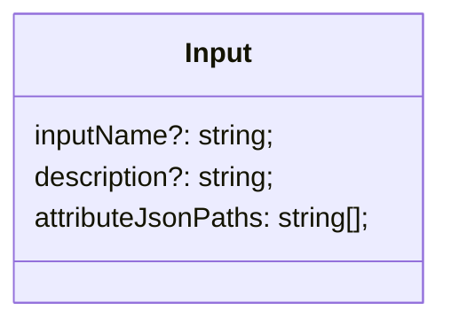
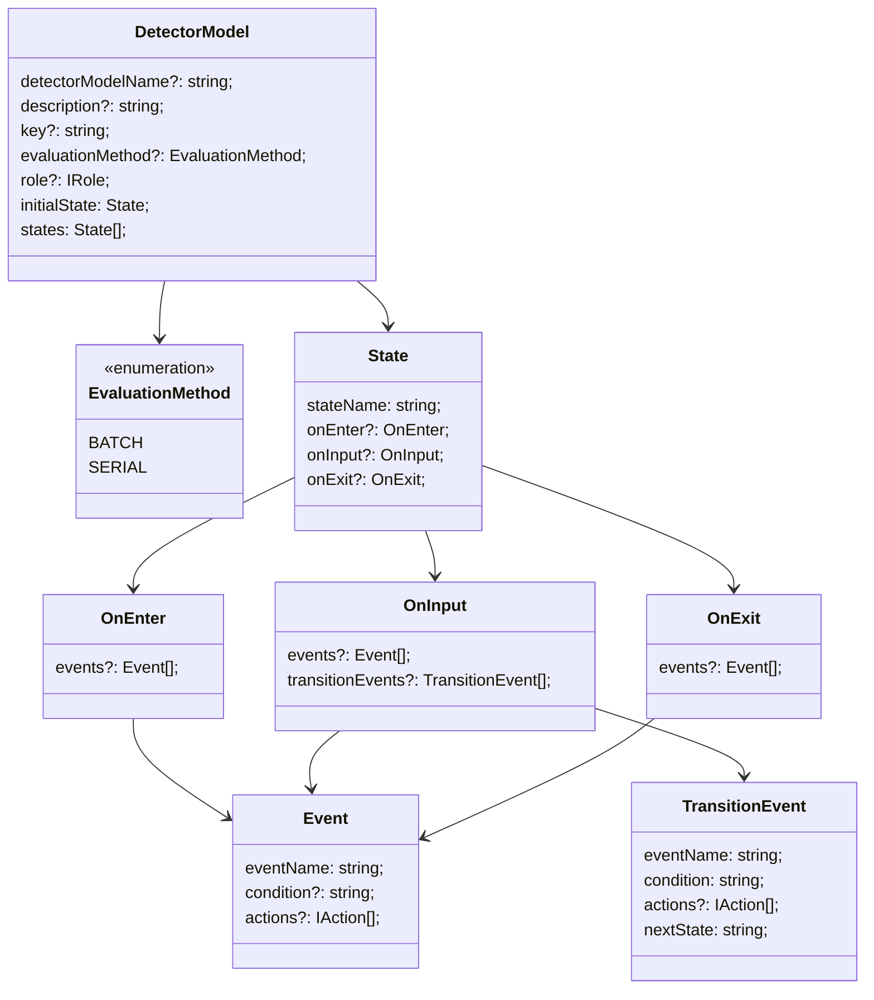

考え中の公開ノート。

## Input

reference: https://docs.aws.amazon.com/AWSCloudFormation/latest/UserGuide/aws-resource-iotevents-input.html

## DetectorModel

reference: https://docs.aws.amazon.com/AWSCloudFormation/latest/UserGuide/aws-resource-iotevents-detectormodel.html

