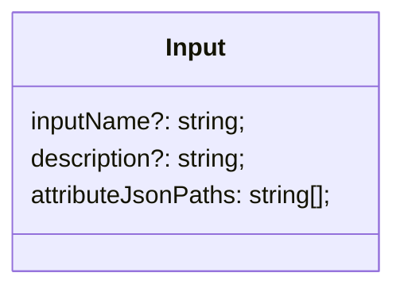
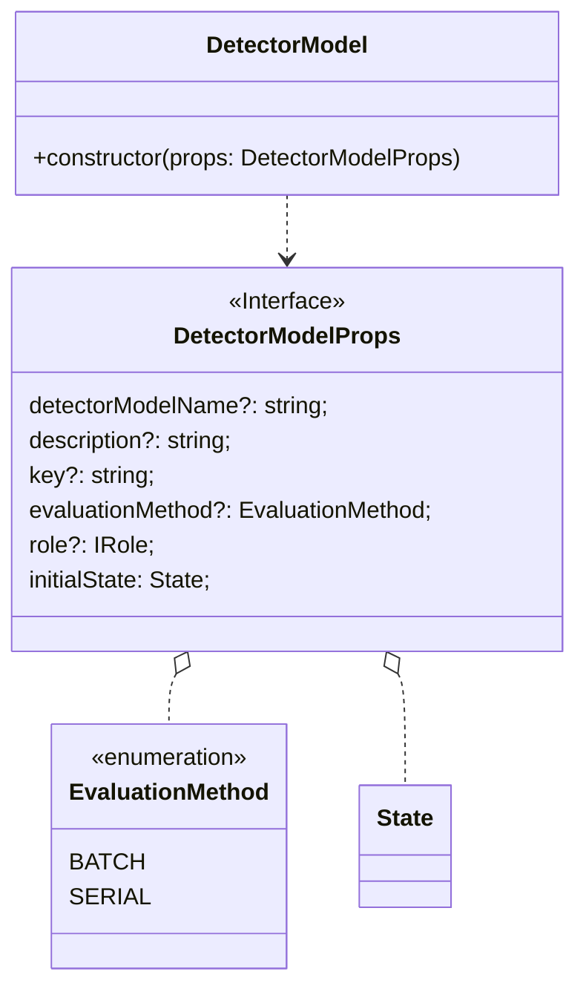
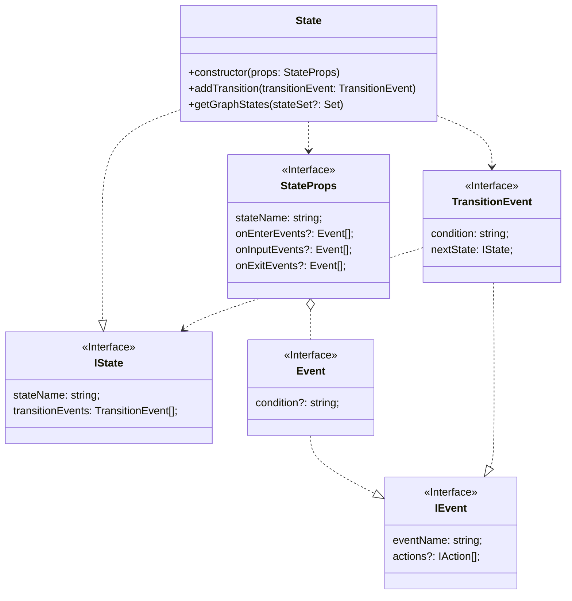

考え中の公開ノート。

## Design

### Input

reference: https://docs.aws.amazon.com/AWSCloudFormation/latest/UserGuide/aws-resource-iotevents-input.html



### DetectorModel

reference: https://docs.aws.amazon.com/AWSCloudFormation/latest/UserGuide/aws-resource-iotevents-detectormodel.html

DetectorModel:



State:



usage:

```ts
const timer = new iotevents.Timer("heartbeatTimer", 60);

// Define nodes of the state machine
const onlineState = new iotevents.State({
  stateName: "online",
  onEnterEvents: [
    {
      eventName: "setTimer",
      actions: [timer.set()], // `timer.set()` return `SetTimerAction`
    },
  ],
  onInputEvents: [
    {
      eventName: "resetTimer",
      condition: 'currentInput("HeartbeatInputData")',
      actions: [timer.reset()], // `timer.reset()` return `ResetTimerAction`
    },
  ],
});
const offlineState = new iotevents.State({
  stateName: "offline",
});

// Define edges of the state machine
onlineState.addTransition({
  eventName: "to_offline",
  condition: timer.timeout(), // `timer.timeout()` return just string
  nextState: offlineState,
});
offlineState.addTransition({
  eventName: "to_online",
  condition: 'currentInput("HeartbeatInputData")',
  nextState: onlineState,
});

// Define the state machine
new iotevents.DetectorModel(this, "DetectorModel", {
  initialState: onlineState,
});
```

DetectorModel:

```ts
class DetectorModel {
  constructor(private readonly initialState: State) {}

  private getDefinition() {
    const stateSet = this.initialState.getGraphStates();

    return {
      initialState: this.initialState.stateName,
      states: Array.from(stateSet).map((state) => state.toCfn()),
    };
  }
}
```

State:

```ts
class State {
  constructor(private readonly props: StateProps) {}

  /**
   * get states recursively
   */
  getGraphStates(stateSet: Set<State> = new Set<State>()): Set<State> {
    if (stateSet.has(this)) {
      return stateSet;
    }
    stateSet.add(this);

    initialState.transitionEvents.forEach((te) => {
      te.nextState.getGraphStates(stateSet);
    });

    return stateSet;
  }
}
```

## Roadmap

1. implement `DetectorModel` and `State` with only required properties
   - It will not be able to have multiple states yet.
2. implement `state.addTransition()`
   - It will be able to have multiple states and to transit.
   - It will not be able to have events that is without transition.
   - It will not be able to perform actions.
3. implement `IAction` and a action `SetTimer`
   - Note: AWS IoT Events has many actions like AWS IoT Core. https://docs.aws.amazon.com/iotevents/latest/apireference/API_Action.html
4. implement some actions (separate PRs for each actions)
   - It will be able to perform actions.
5. implement `Event` and use it in `State`
   - It will be able to have events that is without transition.
6. implement remaining actions (separate PRs for each actions)
