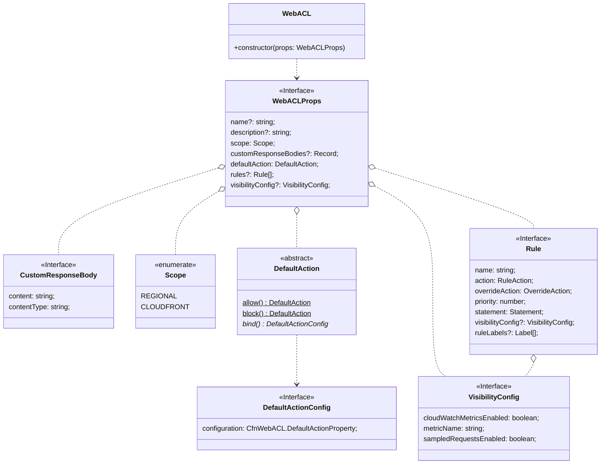
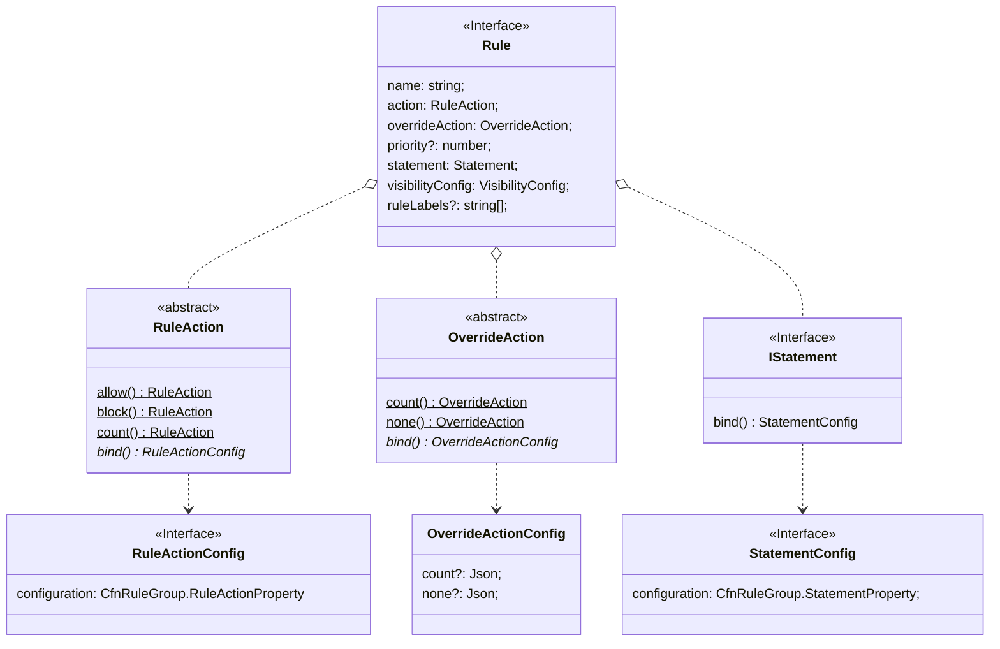

考え中の公開ノート。

## WebACL

### CFn

[webacl](https://docs.aws.amazon.com/AWSCloudFormation/latest/UserGuide/aws-resource-wafv2-webacl.html)

CloudFormation はこんな感じ。


[Statement](https://docs.aws.amazon.com/AWSCloudFormation/latest/UserGuide/aws-properties-wafv2-webacl-statement.html#cfn-wafv2-webacl-statement-ipsetreferencestatement)はめんどいやつ。別パッケージ切るパターンか。

### Design

#### WebACL



#### Rule



Statements

- Logical
  - AndStatement
  - NotStatement
  - OrStatement
- Depends on other resources
  - IPSetReferenceStatement
  - RegexPatternSetReferenceStatement
  - RuleGroupReferenceStatement
- Others
  - ByteMatchStatement
  - GeoMatchStatement
  - LabelMatchStatement
  - ManagedRuleGroupStatement
  - RateBasedStatement
  - SizeConstraintStatement
  - SqliMatchStatement
  - XssMatchStatement

### Usage

```ts
new wafv2.WebACL(this, "WebACL", {
  scope: wafv2.Scope.REGIONAL,
  defaultAction: wafv2.DefaultAction.block(),
  rules: [
    {
      name: "IPSetAllow",
      action: wafv2.RuleAction.allow(),
      statement: new wafv2Statement.IPSetReferenceStatement(ipSet),
    },
    {
      name: "OWASP",
      overrideAction: wafv2.OverrideAction.count(),
      statement: new wafv2Statement.ManagedRuleGroupStatement({
        vendorName: "AWS",
        name: "AWSManagedRulesCommonRuleSet",
      }),
    },
  ],
});
```

> Note: `priority` of the `rules` is automatically numbered according to the order of the `rules`.
> If `priority` is set specifically, all rules must be set `priority`.

> Note: `visibilityConfig` have default value.
> If `WebACLProps.visibilityConfig` is set, Rules inherit it.

### Roadmap

1. implement `WebACL` with only required properties
   - It will not be able to use Rules
1. implement `Rule` with one `Statement`(LabelMatchStatement)
1. implement other remaining properties
1. implement Statements
