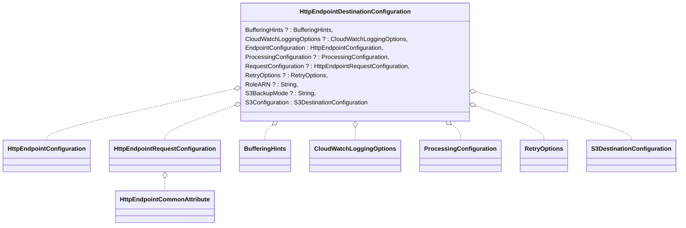
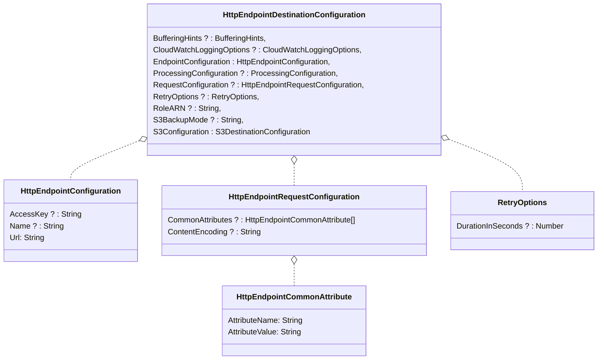

設計メモ

# CFn の形

```mermaid
classDiagram
  HttpEndpointDestinationConfiguration o.. HttpEndpointConfiguration
  HttpEndpointDestinationConfiguration o.. HttpEndpointRequestConfiguration
  HttpEndpointRequestConfiguration o.. HttpEndpointCommonAttribute

  HttpEndpointDestinationConfiguration o.. BufferingHints
  HttpEndpointDestinationConfiguration o.. CloudWatchLoggingOptions
  HttpEndpointDestinationConfiguration o.. ProcessingConfiguration
  HttpEndpointDestinationConfiguration o.. RetryOptions
  HttpEndpointDestinationConfiguration o.. S3DestinationConfiguration

  class HttpEndpointDestinationConfiguration {
    BufferingHints ? : BufferingHints,
    CloudWatchLoggingOptions ? : CloudWatchLoggingOptions,
    EndpointConfiguration : HttpEndpointConfiguration,
    ProcessingConfiguration ? : ProcessingConfiguration,
    RequestConfiguration ? : HttpEndpointRequestConfiguration,
    RetryOptions ? : RetryOptions,
    RoleARN ? : String,
    S3BackupMode ? : String,
    S3Configuration : S3DestinationConfiguration
  }
```

以下についてはすでに実装がある。

- BufferingHints
- CloudWatchLoggingOptions
- ProcessingConfiguration
- S3DestinationConfiguration

それを端折ると

```mermaid
classDiagram
  HttpEndpointDestinationConfiguration o.. HttpEndpointConfiguration
  HttpEndpointDestinationConfiguration o.. HttpEndpointRequestConfiguration
  HttpEndpointRequestConfiguration o.. HttpEndpointCommonAttribute
  HttpEndpointDestinationConfiguration o.. RetryOptions

  class HttpEndpointDestinationConfiguration {
    BufferingHints ? : BufferingHints,
    CloudWatchLoggingOptions ? : CloudWatchLoggingOptions,
    EndpointConfiguration : HttpEndpointConfiguration,
    ProcessingConfiguration ? : ProcessingConfiguration,
    RequestConfiguration ? : HttpEndpointRequestConfiguration,
    RetryOptions ? : RetryOptions,
    RoleARN ? : String,
    S3BackupMode ? : String,
    S3Configuration : S3DestinationConfiguration
  }

  class HttpEndpointConfiguration {
    AccessKey ? : String
    Name ? : String
    Url: String
  }

  class HttpEndpointRequestConfiguration {
    CommonAttributes ? : HttpEndpointCommonAttribute[]
    ContentEncoding ? : String
  }

  class HttpEndpointCommonAttribute {
    AttributeName: String
    AttributeValue: String
  }

  class RetryOptions {
      DurationInSeconds ? : Number
  }
```
