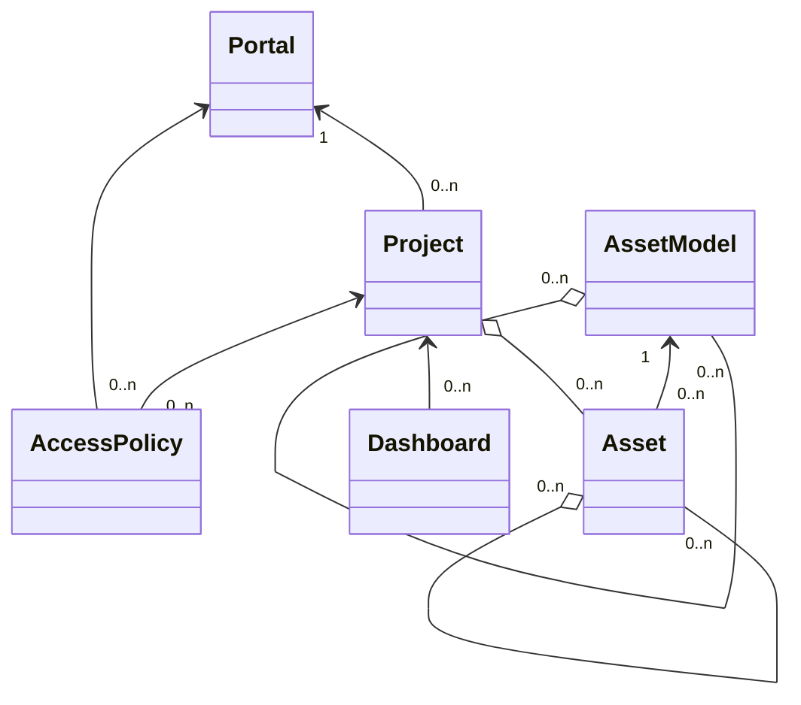

@aws-cdk/aws-iotsitewise コミットしたいなー。の設計メモ

# CFn の形

こいつはすげえ。。。

## AccessPolicy

Identity と (Portal|Project) のマッピング

```yaml
AccessPolicyIdentity:
  IamRole?:
    arn?: String # ==> IAM Role
  IamUser?:
    arn?: String # ==> IAM User
  User?:
    id?: String # ==> ???
AccessPolicyPermission: String
AccessPolicyResource:
  Portal?:
    id: String # ==> SiteWise Portal
  Project?:
    id: String # ==> SiteWise Project
```

## Asset

TopicRule は AssetProperty に向けてデータを投げつける。
AssetHierarchy と Asset has many AssetProperties の概念がまだわからん。

```yaml
AssetName: String
AssetModelId: String # ==> SiteWise Asset Model
AssetHierarchies?:
  - LogicalId: String
    ChildAssetId: String # ==> SiteWise Asset
AssetProperties?:
  - LogicalId: String
    Alias?: String
    NotificationState?: String
```

## AssetModel

AssetModelHierarchy わからん。
AssetModel has many Assets もわからん。
AssetModelProperty に向けてもデータ投げれるのかな。。？

```yaml
AssetModelName: String
AssetModelDescription?: String
AssetModelHierarchies?:
  - LogicalId: String
    Name: String
    ChildAssetModelId: String # ==> SiteWise Asset Model
AssetModelCompositeModels?:
  - Name: String
    Type: String
    Description?: String
    CompositeModelProperties?:
      - AssetModelProperty
AssetModelProperties?:
  - AssetModelProperty
```

### AssetModelProperty

```yaml
LogicalId: String
Name: String
Type: PropertyType
DataType: String
DataTypeSpec?: String
Unit?: String
```

#### PropertyType

```yaml
TypeName: String
Attribute?:
  DefaultValue?: String
Metric?:
  Expression: String
  Variables:
    - ExpressionVariable
  Window:
    Tumbling?:
      Interval: String
      Offset?: String
Transform?:
  Expression: String
  Variables:
    - ExpressionVariable
```

#### ExpressionVariable

```yaml
Name: String
Value:
  PropertyLogicalId: String
  HierarchyLogicalId?: String
```

## Dashboard

```yaml
DashboardName: String
DashboardDescription: String
DashboardDefinition: String
ProjectId?: String # ==> SiteWise Project
```

## Gateway

```yaml
GatewayName: String
GatewayPlatform:
  Greengrass?:
    GroupArn: String # ==> IoT Greengrass
  GreengrassV2?:
    CoreDeviceThingName: String # ==> IoT Greengrass2
GatewayCapabilitySummaries?:
  - CapabilityNamespace: String
    CapabilityConfiguration?: String
```

## Portal

```yaml
PortalName: String
PortalContactEmail: String
RoleArn: String # ==> ???
PortalDescription?: String
NotificationSenderEmail?: String
PortalAuthMode?: String
Alarms?: Json
```

## Project

```yaml
ProjectName: String
PortalId: String # ==> SiteWise Portal
ProjectDescription?: String
AssetIds?:
  - String # ==> SiteWise Asset
```

## グラフ


