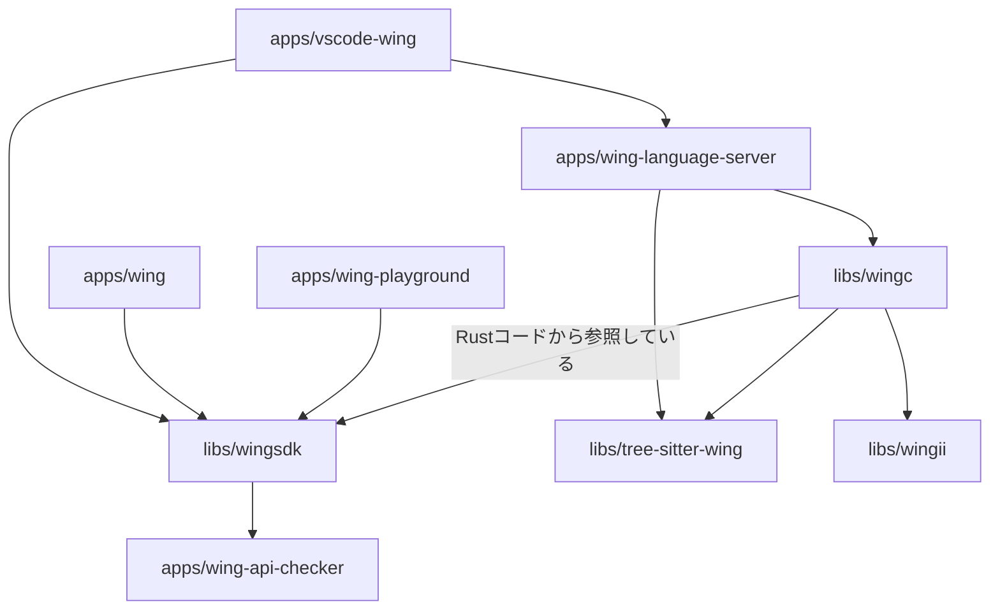

これを読む。

https://github.com/winglang/wing

# コードを読む前に

wing は言語、SDK、ローカル実行環境を含むクラウド開発ツール群で、AWS CDK の作者である Elad Ben が作成している。

言語としての wing (winglang とも) はクラウド指向言語 (Cloud Oriented Language) を名乗っている。
AWS CDK のようにクラウドリソースを定義できると同時に、シームレスに FaaS 上で動くアプリケーションコードを記述できることが最大の特徴である。

## コードサンプル

```wing
bring cloud;

let queue = new cloud.Queue(timeout: 2m);
let bucket = new cloud.Bucket();
let counter = new cloud.Counter(initial: 100);

queue.on_message(inflight (body: str): str => {
  let next = counter.inc();
  let key = "myfile-${next}.txt";
  bucket.put(key, body);
});
```

```wing
resource SafeQueue extends cloud.Queue {
  init() {
    let dlq = new cloud.Queue();

    dlq.on_message(inflight (m: str) => {
      log.error("dead-letter: ${m}");
    });

    this.add_dead_letter_queue(dlq);
  }
}
```

```wing
bring cloud;

let bucket = new cloud.Bucket();

new cloud.Function(inflight (_: str): str => {
  bucket.put("hello.txt", "world");
});
```

# コードを読む

## ディレクトリ構成

```
├─ apps
│   ├─ vscode-wing
│   ├─ wing
│   ├─ wing-api-checker
│   ├─ wing-language-server
│   └─ wing-playground
└─ libs
    ├─ tree-sitter-wing
    ├─ wingc
    ├─ wingii
    └─ wingsdk
```

依存関係:



- **apps/vscode-wing**
  - TS 製
  - wing アプリケーションを開発するための vscode extension
  - 現在の機能:
    - Syntax highlighting
- **apps/wing**
  - TS 製
  - CLI ツール
  - subcommands:
    - run: wing コンソール（wing app のローカル実行環境）を起動する
    - it: run のエイリアス
    - compile: wing application を terraform やローカル実行用にコンパイルする。
    - upgrade: wing CLI 自身を最新化する
- **apps/wing-api-checker**
  - TS 製
  - wingsdk のコードが JSII のプラクティスに倣っているかをチェックする CLI ツール？
- **apps/wing-language-server**
  - Rust 製
  - TODO: 機能を読みたい
- **apps/wing-playground**
  - winglang をブラウザ上で体験できる web app
  - wingc の wasm をブラウザ上で動かしてるっぽい
- **libs/tree-sitter-wing**
  - tree-sitter を用いて winglang を Concrete Syntax Tree に変換する
    - Concrete Syntax Tree は language server で使われる
  - https://github.com/tree-sitter/tree-sitter
- **libs/wingc**
  - Rust 製
  - winglang のコンパイラ
  - wingsdk で生成される JSII 成果物を wingii を用いて Rust コードとして解釈する
- **libs/wingii**
  - Rust 製
  - This crate generates typed Rust structs from the latest version JSII JsonSchema specification. It then aims to offer API to interact with JSII modules outside of Wing compiler's reach. Currently it's basic JSII reflection only.
  - JSII JsonSchema 仕様から Rust のコードを生成し、Wing コンパイラの手の届かないところで JSII モジュールと対話するための API を提供することを目的としている。現在は、基本的な JSII のリフレクションのみ実装されている
- **libs/wingsdk**
  - TS 製
  - winglang 内で`bring`キーワードを使って利用されるモジュール群。
  - TODO: winglang 内で使われるときは型だけ参照しているのかな。
  - TODO: top level からも inflight からも呼び出される工夫があったりするのかな。
  - TODO: `cloud agnostic`を謳っている。それはしんどいやろ。。と思ってしまうな。
