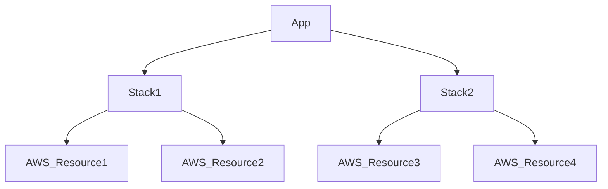
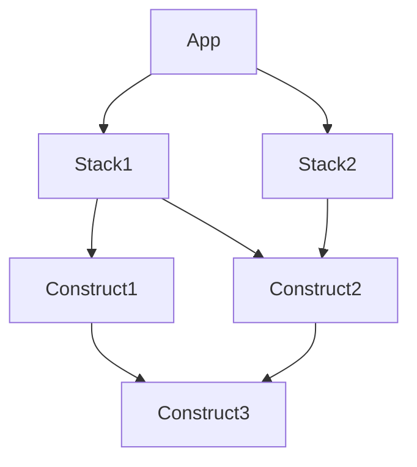
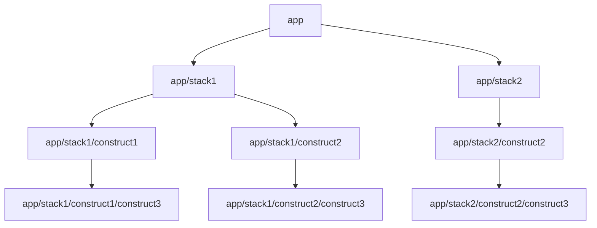
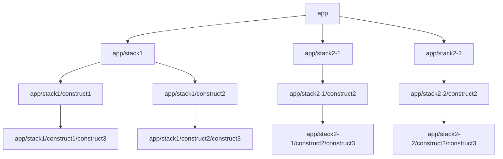

[元ドキュメント](https://docs.aws.amazon.com/cdk/v2/guide/constructs.html)

## tl;dt

AWS CDK では主に App => Stack => AWS_Resource で構成される木構造を定義して、これをデプロイします。この章ではこれらの `App`, `Stack`, `AWS_Resource` すべての基底クラスである `Construct` クラスに焦点を当てて、その仕掛けや派生クラスについて説明しています。

_App => Stack => AWS_Resource の木構造_



## 本文

Construct は、AWS CDK の基本的な構成要素です。 Construct は "cloud component" を表し、CFn がコンポーネントを作成するために必要なすべてのものをカプセル化します。

:::message
Constructs は Construct Programming Model (CPM) の一部であり、CDK for Terraform（CDKtf）、CDK for Kubernetes（CDK8s）、Projen などの他のツールでも使用されます。
:::

Construct は、 S3 バケットなどの単一の AWS リソースを表すことも、複数の AWS 関連リソースの構成を抽象化にすることもできます。このようなコンポーネントの例には、関連する計算能力を備えたワーカーキュー、または監視リソースとダッシュボードを備えたスケジュールされたジョブが含まれます。

AWS CDK には、 AWS Construct Library と呼ばれる Construct のコレクションが含まれており、すべての AWS サービスの Construct が含まれています。 [Construct Hub](https://constructs.dev/search) は、AWS、サードパーティ、およびオープンソース CDK コミュニティからの追加の Construct を発見するのに役立ちます。

https://constructs.dev/search

### AWS Construct library

AWS CDK の API リファレンス

https://docs.aws.amazon.com/cdk/api/v2/docs/aws-construct-library.html

### Composition

_Composition_ は、 Construct を介して高レベルの抽象化を定義するための重要なパターンです。高レベルの Construct は、任意の数の低レベルの Construct から構成できます。さらに、それらは、最終的に AWS リソースから構成される、さらに低レベルの Construct から構成できます。ボトムアップの観点からは、Construct を使用して、デプロイする個々の AWS リソースを、必要な数のレイヤーを使用して、目的に便利な抽象化を使用して整理します。

Composition を使用すると、再利用可能なコンポーネントを定義して、他のコードと同じように共有できます。たとえば、チームは、バックアップ、グローバルレプリケーション、オートスケーリング、モニタリングを備えた DynamoDB テーブルの会社のベストプラクティスを実装する構成を定義し、それを組織内の他のチームと共有したり、公開したりできます。チームは、テーブルを定義し、チームのベストプラクティスに準拠するために、好みのプログラミング言語の他のライブラリパッケージと同じように、この構成を使用できるようになりました。ライブラリが更新されると、開発者は、他のタイプのコードに対してすでに持っているワークフローを通じて、新しいバージョンのバグ修正と改善にアクセスできるようになります。

### Initialization

Construct は、 Construct base class を拡張して実装されます。クラスをインスタンス化することにより、 Construct を定義します。すべての Construct は、初期化時に 3 つのパラメーターを取ります。

- **Scope** – 親となる Construct をここに渡します。通常は `this` を渡します。これによりクラスのインスタンスを親 Construct として、新たな Construct が生成することができます。
- **id** – この Scope 内で一意である必要がある [Identifier](./07-concepts-identifiers) 。 Identifier は、現在の Construct 内で定義されているすべての名前空間として機能し、[resource name](./06-concepts-resources#Physical-names)や CFn の論理 ID などの一意の ID を割り当てるために使用されます。
- **Props** – Construct の設定値。ほとんどの場合、 Construct は適切なデフォルトが定義されています。すべての props 要素がオプションの場合は、props パラメーターを完全に省略できます。

Identifier は、 Scope 内で一意でさえあればいいです。つまり、Scope が異なるなら id の重複は許容されます。これのおかげで、同一 Scope 内で Construct の再利用ができます。

```ts
class MyConstruct extends Construct {
  constructor(scope, id) {
    super(scope, id);
    new FooConstruct(this, "foo");
  }
}
new MyConstruct(this, "bar");
new MyConstruct(this, "buz");
// idが異なるならMyConstructを複数回newできます。
// このとき Identifier に注目して見てみると
// this scope
//   ├─ "bar"
//   │   └─ "foo"
//   └─ "buz"
//       └─ "foo"
// というようにthis Scopeでは"foo"が2つ存在しています。
// しかし、それぞれ"bar" Scopeと"buz" Scopeに所属しているため、エラーになることはありません。
// この性質のおかげでMyConstructを問題なく再利用することができます。
```

また、 Scope を使用することで、 tagging やデプロイ先の指定など、 Construct のグループを一度に参照することができます。

### Apps and stacks

CDK アプリケーションを app と呼び、 [App クラス](https://docs.aws.amazon.com/cdk/api/v2/docs/aws-cdk-lib.App.html) で表現されます。次の例では、バージョニングが有効になっている単一の S3 バケットを含む単一の Stack を持つ app を定義しています。

```ts
import { App, Stack, StackProps } from "aws-cdk-lib";
import * as s3 from "aws-cdk-lib/aws-s3";

class HelloCdkStack extends Stack {
  constructor(scope: App, id: string, props?: StackProps) {
    super(scope, id, props);

    new s3.Bucket(this, "MyFirstBucket", {
      versioned: true,
    });
  }
}

const app = new App();
new HelloCdkStack(app, "HelloCdkStack");
```

上記のとおり、バケットを定義するためには、 Scope が必要です。リソースは最終的に AWS CloudFormation スタックの一部として、 AWS 環境にデプロイされる必要があるためです。`s3.Bucket`のような AWS Construct は、 Stack の Scope 内で定義する必要があります。

app の Stack は、上記に示すように、[Stack クラス](https://docs.aws.amazon.com/cdk/api/v2/docs/aws-cdk-lib.Stack.html)を拡張します。これは、app 内で Stack を作成する場合の一般的なパターンです。次の例に示すように。

```ts
class HelloCdkStack extends Stack {
  constructor(scope: App, id: string, props?: StackProps) {
    super(scope, id, props);

    //...
  }
}
```

### Using L1 constructs

Stack を定義したら、 その中で Construct をインスタンス化していきます。まず、 L1 Construct を使用して実行します。

L1 Construct は、CFn の定義から自動生成されています。ここでは、[CfnBucket クラス](https://docs.aws.amazon.com/cdk/api/v2/docs/aws-cdk-lib.aws_s3.CfnBucket.html)を使用して S3 バケットを作成する方法を説明します。

```ts
const bucket = new s3.CfnBucket(this, "MyBucket", {
  bucketName: "MyBucket",
});
```

### Using L2 constructs

次の例では、[Bucket クラス](https://docs.aws.amazon.com/cdk/api/v2/docs/aws-cdk-lib.aws_s3.Bucket.html)の L2 Construct を作成して S3 バケットを定義します。

```ts
import * as s3 from "aws-cdk-lib/aws-s3";

// "this" is HelloCdkStack
new s3.Bucket(this, "MyFirstBucket", {
  versioned: true,
});
```

:::message
**Note**
上記の例で作成するバケットの名前では`MyFirstBucket`ありません。新しい Construct に与えられた logical identifier が設定されます。詳細については、[Physical names](./06-concepts-resources#Physical-names) を参照してください。
:::

### Configuration

ほとんどの Construct は 第３引数として props を受け取ります。次の例では、AWS KMS 暗号化と静的ウェブサイトホスティングが有効になっているバケットを定義しています。暗号化キーを明示的に指定しないため、この`Bucket` Construct は[内部的に `new kms.Key` を定義し、それをバケットに関連付けます。](https://github.com/yamatatsu/aws-cdk/blob/eca1e748913979646e59f4d740cf26e1c0e0f9ef/packages/@aws-cdk/aws-s3/lib/bucket.ts#L1806-L1808)

```ts
new s3.Bucket(this, "MyEncryptedBucket", {
  encryption: s3.BucketEncryption.KMS,
  websiteIndexDocument: "index.html",
});
```

Construct は、「sensible defaults（気の利いたデフォルト値）」の概念に基づいて設計されています。ほとんどの構成には最小限の必要な構成があり、必要なときに構成を完全に制御しながら、すばやく開始できます。

### Interacting with constructs

Construct は、基本の [Construct クラス](https://docs.aws.amazon.com/cdk/api/v2/docs/constructs.Construct.html)を extends したクラスです。Construct のインスタンスは、内部で持っている別の Construct を操作したり参照したりできる一連のメソッドとプロパティを公開します。AWS CDK フレームワークは、Construct の API に制限を設けていません。作成者は、必要な API を定義できます。ただし、AWS Construct Library に含まれている AWS Construct（`s3.Bucket`など）、すべての AWS リソースで一貫したエクスペリエンスを提供するために、ガイドラインと一般的なパターンに従ってください。

たとえば、ほとんどすべての AWS Construct には、その Construct に対する AWS IAM アクセス許可をプリンシパルに付与するために使用できる一連の付与メソッド（`grantXXX`）があります。次の例では、IAM グループ（`"data-science"`）に S3 バケット（`"raw-data"`）の読み取り権限を付与します 。

```ts
const rawData = new s3.Bucket(this, "raw-data");
const dataScience = new iam.Group(this, "data-science");
rawData.grantRead(dataScience);
```

もう 1 つの一般的なパターンは、AWS Construct に、別で提供されたデータからリソースの属性(attributes)（ARN、name、URL など）を与えることです。たとえば、次のコードでは AWS Lambda 関数に対して、環境変数の`QUEUE_URL` を介して SQS の URL を与えます。

```ts
const jobsQueue = new sqs.Queue(this, "jobs");
const createJobLambda = new lambda.Function(this, "create-job", {
  runtime: lambda.Runtime.NODEJS_14_X,
  handler: "index.handler",
  code: lambda.Code.fromAsset("./create-job-lambda-code"),
  environment: {
    QUEUE_URL: jobsQueue.queueUrl,
  },
});
```

:::message alert
上記の例にて、CDK のランタイム上では、`jobsQueue.queueUrl`が持つ文字列は実際の URL 文字列ではありません。CFn テンプレートとしてアウトプットされた際に`{ Ref: <CFn上のResource名> }`のように変換される文字列が入っています。この`{ Ref: <CFn上のResource名> }`は CFn によってリソース間の依存関係として解釈され、CFn はこれをもとにリソースの生成順序をコントロールします。このように「CFn によって解釈される依存関係」を CDK 上で表現しないと、デプロイ時に（開発時には発生しなかった）思わぬデプロイエラーが発生することがあります。
:::

AWS Construct Library の一般的な API パターンについては、[resources](./06-concepts-resources)を参照してください。

### Writing your own constructs

`s3.Bucket`のような既存の Construct を使うだけでなく、自分で Construct を書いて、それを誰でも app で使えるようにすることも可能です。AWS CDK では、すべての Construct が等価です。`s3.Bucket` や `sns.Topic` のような AWS CDK の Construct は、誰かが公開した NPM ライブラリや、あなたの会社の内部パッケージリポジトリから取り込んだ Construct と同じ振る舞いをします。

新しい Construct を宣言するには、パッケージ内に [Construct 基本クラス](https://docs.aws.amazon.com/cdk/api/v2/docs/constructs.Construct.html) を extends したクラスを作成し、constructs 初期化引数のパターンに従います。

たとえば、誰かがファイルをアップロードするたびに Amazon SNS 通知を送信する S3 バケットを表す Construct を宣言できます。

```ts
export interface NotifyingBucketProps {
  prefix?: string;
}

export class NotifyingBucket extends Construct {
  constructor(scope: Construct, id: string, props: NotifyingBucketProps = {}) {
    super(scope, id);
    const bucket = new s3.Bucket(this, "bucket");
    const topic = new sns.Topic(this, "topic");
    bucket.addObjectCreatedNotification(new s3notify.SnsDestination(topic), {
      prefix: props.prefix,
    });
  }
}
```

:::message
**Note**
上記の`NotifyingBucket`クラスは Bucket クラスではなく、Construct クラスを継承しています。 S3 バケットと Amazon SNS トピックを一緒にバンドルするために、継承ではなくコンポジションを使用しています。一般的に、AWS CDK の Construct を開発する場合、継承よりもコンポジションが推奨されます。
:::

Typically, you would also want to expose some properties or methods on your constructs. For example, it's not very useful to have a topic hidden behind your construct, because it wouldn't be possible for users of your construct to subscribe to it. Adding a topic property allows consumers to access the inner topic, as shown in the following example:

通常、Construct のいくつかのプロパティまたはメソッドも公開する必要があります。たとえば、上記のように topic を`constructor`のローカル変数として扱うと Construct のユーザーが topic をサブスクライブすることはできません。topic 次の例に示すように、プロパティに追加すると、 Construct のユーザーは topic にアクセスできます。

```ts
export class NotifyingBucket extends Construct {
  public readonly topic: sns.Topic;

  constructor(scope: Construct, id: string, props: NotifyingBucketProps) {
    super(scope, id);
    const bucket = new s3.Bucket(this, "bucket");
    this.topic = new sns.Topic(this, "topic");
    bucket.addObjectCreatedNotification(
      new s3notify.SnsDestination(this.topic),
      { prefix: props.prefix }
    );
  }
}
```

これでユーザーは topic をサブスクライブすることができます。

```ts
const queue = new sqs.Queue(this, "NewImagesQueue");
const images = new NotifyingBucket(this, "/images");
images.topic.addSubscription(new sns_sub.SqsSubscription(queue));
```

### The construct tree

すでに見てきたように、AWS CDK アプリでは、scope 引数を使用して、Construct の「内部」に Construct を定義します。このようにして、AWS CDK アプリは、Construct tree と呼ばれる Construct の階層を定義します。

このツリーのルートは app、つまり App クラスのインスタンスです。app 内で、1 つ以上の Stack をインスタンス化します。Stack 内で、AWS CloudFormation リソースまたは上位レベルの Construct をインスタンス化します。これらの Construct 自体が、リソースやその他の Construct をインスタンス化する場合があります。

Construct は*常に*別の Construct の Scope 内で明示的に定義されるため、Construct 間の関係に疑いはありません。ほとんどの場合、Scope として `this` を渡す必要があります。これは、新しい Construct が現在の Construct（`this`） の子であることを示します。

スコープを明示的に渡すと、各 Construct がツリーに追加されます。[この動作は Construct 基本クラスにて定義されています。](https://github.com/yamatatsu/constructs/blob/9dce6b293365de58617ca3463a24f0ececc72c51/src/construct.ts#L69)AWS CDK でサポートされているすべての言語で同じように機能し、イントロスペクションやその他の「魔法」を必要としません。

:::message alert
**Important**
技術的には、Constructor のインスタンスを作成するときに、`this`以外の Scope を渡すことができます。たとえば、引数で渡された Scope に Construct を追加する mixin スタイルの関数を書くことができます。しかし、この場合、Construct の ID が他の Scope で一意であることを確認するのが難しいという問題があります。また、コードの理解や保守、再利用が難しくなります。事実上、Scope 引数を乱用することなく、意図を表現する方法を見つける方がよいです。
:::

AWS CDK は、ツリーのルートから各子 Construct へのパスにあるすべての Construct の ID を使用して、AWSCloudFormation に必要な一意の ID を生成します。このアプローチは、Construct ID が、ネイティブ AWS CloudFormation のようにスタック全体内ではなく、スコープ内でのみ一意である必要があることを意味します。ただし、Construct を別のスコープに移動すると、生成されたスタック固有の ID が変更され、AWSCloudFormation はそれを同じリソースと見なさなくなります。（つまりリソースが再作成されます。DynamoDB のテーブルが再作成によってデータが消失してしまわないように注意する必要があります。）

Construct tree は、AWS CDK コードで定義した Construct 群とは別ものですが、ツリー内でその Construct を表すノードへの参照である Construct の属性を介してアクセスできます。各ノードは Node インスタンスであり、その属性はツリーのルートとノードの親スコープおよび子へのアクセスを提供します。

Construct tree は、AWS CDK のコードで定義した Construct とは別のものですが、Construct の node 属性を通じてアクセスすることができ、これはツリー内のその Construct を表す node への参照となります。各 node は [Node](https://docs.aws.amazon.com/cdk/api/v2/docs/constructs.Node.html) インスタンスであり、その属性によってツリーのルート、node の親スコープと子 node にアクセスできます。

- `node.children` – 直下の子 Construct 配列
- `node.id` – Construct の Identifier
- `node.path` – すべての親の ID を含む Construct のフルパス。
- `node.root` – 構成ツリーのルート（app）
- `node.scope` – Construct の Scope（親）
- `node.scopes` – ルートまでの Construct のすべての親。祖先配列
- `node.uniqueId` – ツリー内のこの Construct の一意の英数字の Identifier（デフォルトでは`node.path`とハッシュから生成されます）

Construct tree は、Construct が最終的な CFn テンプレートのリソースに合成される暗黙の順序を定義します。あるリソースを別のリソースの前に作成する必要がある場合、AWS CloudFormation または AWS Construct Library は通常、依存関係を推測し、リソースが正しい順序で作成されていることを確認します。`node.addDependency();`を使用して、2 つのノード間に明示的な依存関係を追加することもできます。AWS CDK API リファレンスの依存関係を参照してください。

The AWS CDK provides a simple way to visit every node in the construct tree and perform an operation on each one. See Aspects.

AWS CDK は、Construct tree 内のすべての node にアクセスし、各 node で操作を実行する簡単な方法を提供します。[Aspects](./15-concepts-aspects)を参照してください。

やまたつ解説

App も Stack も Construct を継承している。これらの Construct はクラスの依存関係で見ると依存グラフを構成する。



しかし、scope と id を与えてインスタンス化することで木構造を構成できる。これが Construct tree である。



id を与え、それを先祖まで遡ることで、各 Construct は常に一意な`node.path`上に生成される。例えば、上記の例を修正し、App 内で Stack2 を 2 回 new（`id: "stack2-1"`,`id: "stack2-2"`）したとしても、各 Construct の path は常に一意となる。


